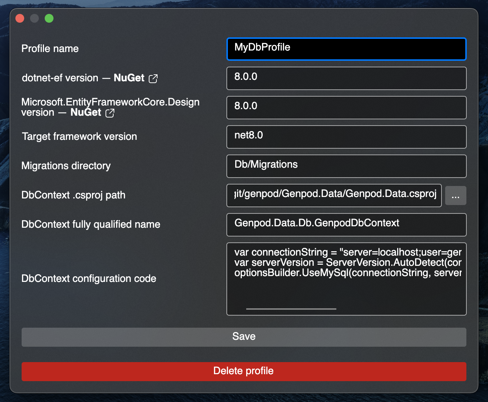

# efmig

This is a multi-platform (Windows, macOS, Linux) GUI application that makes working with Entity Framework Core migrations easier.

[](https://github.com/stil/efmig/actions/workflows/build.yml)


Why you should use it:
* You'll no longer need to remember `dotnet ef` commands syntax for creating, removing and generating migration scripts.
* Dependency on `Microsoft.EntityFrameworkCore.Design` can be dropped inside your project.
* You can remove `IDesignTimeDbContextFactory<TDbContext>` implementations from your project.

**Important**: This tool **does not** apply migrations on your database. It's designed to be non-destructive and you're expected to generate migration script, review it and run it manually in database client of your choice.

## Configuration

1. Download binaries for your platform from Releases page and launch the `efmig` executable.
2. Click `[+]` button to create a new configuration profile.
3. Fill configuration values
   - Profile name: this is a label of your choice for configuration profile.
   - dotnet-ef version: See [NuGet page](https://www.nuget.org/packages/dotnet-ef/#versions-body-tab) for available versions. Enter version matching your project.
   - Microsoft.EntityFrameworkCore.Design version: See [NuGet page](https://www.nuget.org/packages/Microsoft.EntityFrameworkCore.Design/#versions-body-tab) for available versions.
   - Target framework version: See [this reference table](https://learn.microsoft.com/en-us/dotnet/standard/frameworks#supported-target-frameworks) for available versions.
   - Migrations directory. Enter a path relative to location of C# project where DbContext exists. Default value is `Migrations`.
   - DbContext .csproj path: pick the path of C# project that holds your DbContext class.
   - DbContext fully qualified name: this is a full class name of DbContext, for example `MyApp.MyDbContext`.
   - DbContext configuration code: here you need to configure connection string for `dotnet-ef` to work. See [explanation below](#dbcontext-configuration-code). 
4. Save profile.

### DbContext configuration code

`optionsBuilder` variable of type `DbContextBuilder<TYourDbContext>` is defined and you are expected to configure connection string using C# syntax.

Postgres example
```csharp
var connectionString = "Host=myserver;Username=mylogin;Password=mypass;Database=mydatabase";
optionsBuilder.UseNpgsql(connectionString);
```

MySQL example
```csharp
var connectionString = "server=localhost;user=myuser;password=mypassword;database=mydb;";
var serverVersion = ServerVersion.AutoDetect(connectionString);
optionsBuilder.UseMySql(connectionString, serverVersion);
```

## Usage
You can invoke one of the following actions:
- Create a new migration. Specify its name beforehand and click `[+]` button on the right.
- General actions:
  - List migrations. This action does nothing but lists already existing migrations.
  - Generate migration script. This action opens default text editor with SQL code of all migrations for you to review.
  - Generate optimized model.
- Last migration actions:
  - Remove from code. This action removes most recent migration from **the code**. Nothing will happen on the actual database. Will fail if the migration is already applied on database - in that case, use "Generate rollback script" action first.
  - Generate apply script. This actions generates SQL script of last migration for you to review and manually apply.
  - Generate rollback script. This action generates SQL script that rolls back last migration for you to review and manually apply.


## Other screenshots

#### Profile configuration


#### Migration script output

